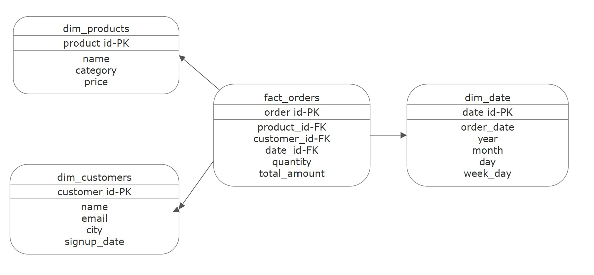

#  ETL Pipeline with Star Schema 

This project demonstrates a simple **ETL pipeline** and **data warehouse schema design** using Python and DuckDB.  
It extracts raw CSV files, cleans & transforms the data, builds a **Star Schema**, and saves the results as new CSVs for SQL analytics.  

## Project Structure
```
data_engineering/
├── etl_pipeline.py # Main ETL & SQL execution script
├── duckdb_execute.py # Main ETL & SQL execution script
├── output/ # Output CSVs for star schema tables
│ ├── dim_customers.csv
│ ├── dim_products.csv
│ ├── dim_date.csv
│ └── fact_orders.csv
├── data/ # Output CSVs for star schema tables
│ ├── customers_raw.csv
│ ├── products_raw.csv
│ └── orders_raw.csv
├── sql/ # SQL query files
│ ├── best_selling_category.sql
│ ├── monthly_revenue.sql
│ ├── top_customers.sql
│ └── revenue_by_city.sql
├── sql_outputs/ # Generated SQL query outputs (created automatically)
└── README.md # Project documentation
```
## Get started

1. **Clone the repository**
2. **Install dependencies:**
   ```bash
   pip install pandas duckdb
   ```
3. **Run the ETL pipeline:**
   ```bash
   python etl_pipeline.py

   Generated Star Schema CSVs will be created in the output/ folder:

    dim_customers.csv
    dim_products.csv
    dim_date.csv
    fact_orders.csv

   ```
4. **Execute analytics:**
   ```bash
   python duckdb_execute.py
   ```

---


## Star Schema Diagram



## How to Run the Pipeline

1. **Clone the repository**
2. **Install dependencies:**
   ```bash
   pip install pandas duckdb
   ```
3. **Run the ETL pipeline:**
   ```bash
   python etl_pipeline.py
   ```

## Running SQL Queries

{/*Top 5 customers by total spend*/}

SELECT 
    c.customer_id,
    c.customer_name,
    SUM(f.total_amount) AS total_spend
FROM orders_df f
JOIN customers_df c ON f.customer_id = c.customer_id
GROUP BY c.customer_id, c.customer_name
ORDER BY total_spend DESC
LIMIT 5;

Execute them with DuckDB in Python:
``` bash
  python duckdb_execute.py
```


## Example Query Outputs
Best-Selling Category
```
category	total_units_sold	total_revenue
electronics	9.0	                4256.0

Saved: sql_outputs/best_sell_cat_query1.csv
```
Revenue by City
```
city	        city_revenue
Phoenix	        1200.0
Philadelphia    1100.0
Los Angeles	    999.0
Houston	        850.0
Washington	    800.0

```

Saved: sql_outputs/city_revenue_query1.csv

```
Monthly Revenue
year	month	monthly_revenue
2021	2	    799.0
2021	3	    999.0
2021	6	    498.0
2021	8	    850.0
2021	9	    1200.0


```

Saved: sql_outputs/monthly_revenue_query1.csv

Top Customers

```
customer_id	customer_name	total_spend
5	        David Wilson	1200.0
6	        Linda Martinez	1100.0
2	        Sarah Johnson	999.0
4	        Emily Davis	    850.0
20	        Nancy Rodriguez	800.0

```
Saved: sql_outputs/top_customers_query1.csv